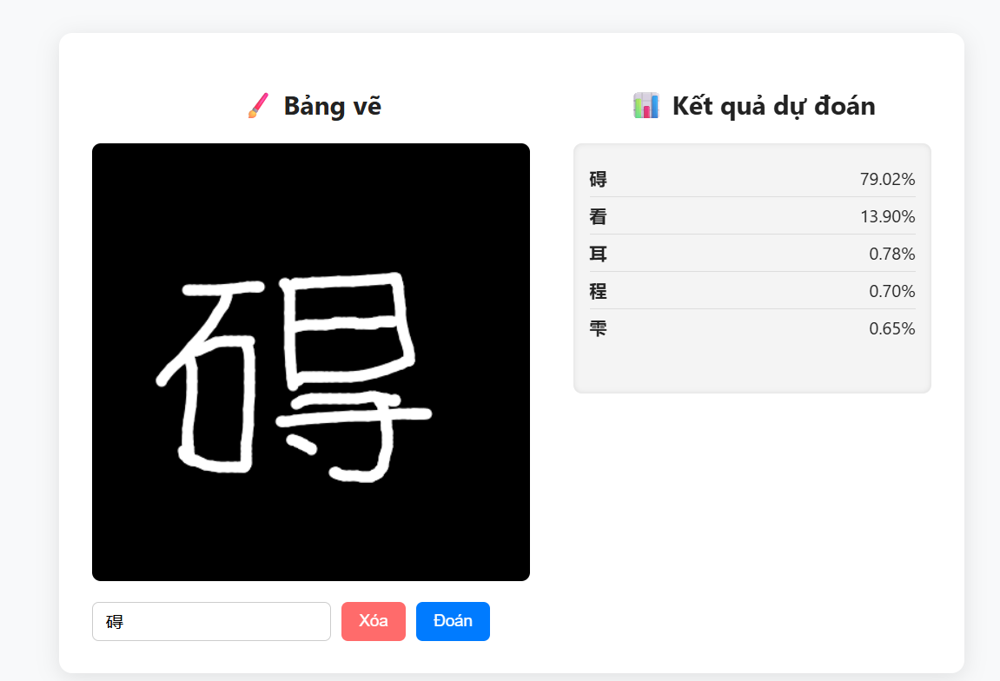
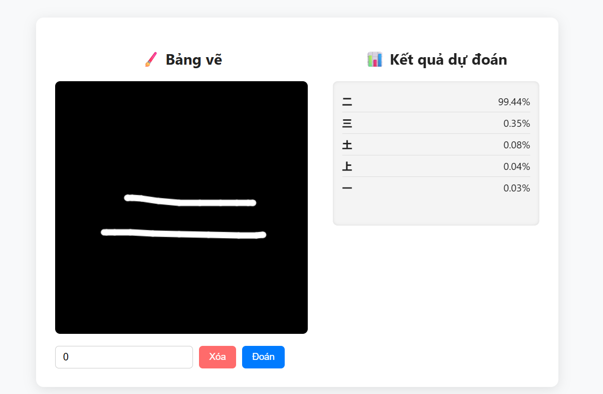
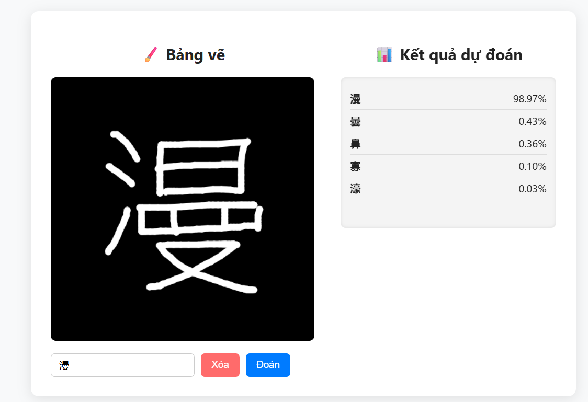

# 🈶 kanji-ml-server  
**AI server for Kanji prediction model (CNN + FastAPI)**  

Dự án này triển khai mô hình **CNN (Convolutional Neural Network)** để nhận dạng và dự đoán **chữ Hán (Kanji)**.  
FastAPI được sử dụng để xây dựng REST API và giao diện tương tác trực tiếp qua endpoint `/canvas`.

## ⚙️ Hướng dẫn cài đặt và chạy demo

### 1️⃣ Clone dự án

```bash
git clone https://github.com/nhutphat1203/cnn-kanji.git
cd cnn-kanji
````

### 2️⃣ Tạo và kích hoạt môi trường ảo (virtual environment)

```bash
python -m venv venv
# Windows
venv\Scripts\activate
# Linux / macOS
source venv/bin/activate
```

### 3️⃣ Cài đặt các thư viện phụ thuộc

```bash
pip install -r requirements.txt
```

### 4️⃣ Chạy FastAPI server

```bash
fastapi dev .\src\main.py
```

Sau khi chạy thành công, terminal sẽ hiển thị:

```
Server running on http://127.0.0.1:8000
```

---

## 🧠 Kiểm tra mô hình

Mở trình duyệt và truy cập:
👉 **[http://127.0.0.1:8000/canvas](http://127.0.0.1:8000/canvas)**

Tại đây bạn có thể **vẽ trực tiếp chữ Kanji**, nhấn **Predict** để gửi ảnh tới server và xem mô hình CNN dự đoán kết quả.


## 🚀 Hướng phát triển

* Mở rộng mô hình để nhận dạng nhiều chữ Kanji phức tạp hơn.
* Hỗ trợ upload ảnh hàng loạt để dự đoán nhiều chữ cùng lúc.
* Tối ưu tốc độ inference bằng TensorRT hoặc ONNX Runtime.
* Bổ sung dashboard thống kê độ chính xác của mô hình.

## 🖼️ Hình ảnh minh họa

| 🧩 Canvas Demo 1 | 🧩 Canvas Demo 2 | 🧩 Canvas Demo 3 |
|:----------------:|:----------------:|:----------------:|
|  |  |  |


## 📦 Dữ liệu huấn luyện: ETL9G Dataset

Dự án sử dụng **ETL9G**, một trong những bộ dữ liệu chữ viết tay tiếng Nhật do **ETL Character Database** (thuộc NTT Laboratories, Nhật Bản) phát hành.

### 🧾 Giới thiệu
**ETL9G** là bộ dữ liệu chữ viết tay quy mô lớn, được thiết kế để nghiên cứu **nhận dạng ký tự tiếng Nhật (Japanese OCR)**.  
Mỗi ký tự trong bộ dữ liệu được viết tay bởi nhiều người Nhật khác nhau, giúp mô hình học được sự đa dạng của nét chữ.

### 🔍 Thông tin chi tiết
- **Số lượng ký tự:** 3036 ký tự (bao gồm Kanji, Hiragana, Katakana và một số ký tự Latin cơ bản).  
- **Số người viết:** 160 người.  
- **Tổng số mẫu ảnh:** khoảng **1,015,360 hình ảnh** (3036 ký tự × 160 mẫu × biến thể).  
- **Kích thước ảnh:** 128×127 pixels, ảnh grayscale (8-bit).  
- **Định dạng gốc:** Binary (`.ETL9G`) — được lưu trữ theo cấu trúc record đặc trưng của ETL dataset.  
- **Định dạng chuyển đổi thường dùng:** PNG hoặc NumPy array (để dùng trong huấn luyện mô hình CNN).  
- **Môi trường thu thập:** Viết tay trên bảng điện tử với độ phân giải cao, được xử lý để đồng nhất nét mực và tỷ lệ khung hình.

### 🧠 Cách sử dụng trong dự án
Trong dự án **cnn-kanji**, bộ ETL9G được:
1. Giải mã từ file nhị phân ETL9G gốc thành ảnh grayscale 128×127.  
2. Chuẩn hóa cường độ pixel về khoảng `[0, 1]`.  
3. Chuyển đổi nhãn từ mã **JIS (Japanese Industrial Standards)** sang **Unicode**, để mô hình CNN có thể dự đoán ký tự chính xác.  
4. Chia dữ liệu thành các tập:
   - **Training set:** 80%  
   - **Validation set:** 10%  
   - **Test set:** 10%


### ⚠️ Lưu ý bản quyền
ETL9G là dữ liệu công khai cho mục đích **nghiên cứu học thuật và phi thương mại**

Nguồn tham khảo: [ETL Character Database](http://etlcdb.db.aist.go.jp/the-etl-character-database/)
